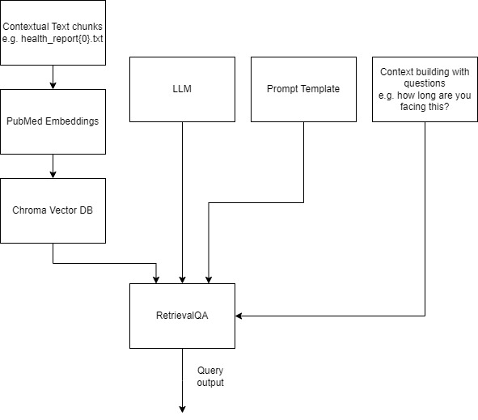
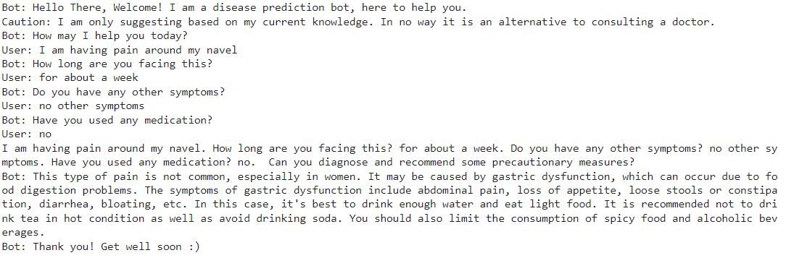

# Disease Prediction Using LLM

This project leverages Large Language Models (LLMs) to create an advanced disease prediction system for healthcare applications.

## Overview

Our system utilizes BioMistral-7B, a medical LLM trained on a comprehensive corpus of biomedical text data, integrated with a Retrieval-Augmented Generation (RAG) mechanism. This combination allows for accurate disease prediction based on patient health reports and user queries.

## Key Features

- **BioMistral-7B LLM**: Specialized medical language model trained on PubMed Central data
- **Retrieval-Augmented Generation (RAG)**: Enhances prediction accuracy by retrieving relevant medical reports
- **Chroma DB Vector Store**: Efficient storage and retrieval of biomedical document embeddings
- **Few-Shot Learning**: Utilizes prompt engineering for improved context understanding
- **Quantized Model**: Optimized for performance on devices with limited processing power

## Model Architecture

1. **Embedding**: NeuML/pubmedbert-base-embeddings for converting text to dense vector representations
2. **Vector Store**: Chroma DB for efficient storage and retrieval of embeddings
3. **LLM**: BioMistral-7B (quantized version) as the core language model
4. **Prompt Template**: Incorporates few-shot learning for improved performance
5. **Retrieval QA**: Combines knowledge sources for comprehensive answers



## Data Sources

- PubMed Central (PMC) Open Access Subset
- Open-source patient health reports

## Example conversation


## Experimental Approach

We conducted experiments to optimize:

1. Word Embeddings
2. Model Architectures
3. Hyperparameter Tuning
4. Vector Databases

## Evaluation

The system was evaluated using both intrinsic metrics (ROGUE-L) and human evaluation considering factors such as helpfulness, fluency, and relevance.

## Results

| Model Name    | Helpfulness | Fluency | Relevance | ROGUE-L |
|---------------|-------------|---------|-----------|---------|
| Meditron 7B   | 3.56        | 4.12    | 3.68      | 0.33    |
| Bio-Mistral 7B| 3.77        | 4.32    | 4.17      | 0.3     |

## Conclusion

While our Disease Prediction LLM shows promising results, there's room for improvement. Future work could focus on expanding the dataset and refining the model's performance in specific medical contexts.

## Installation & Usage

1. Clone the repository:
   ```bash
   git clone https://github.com/nandhishtr/DiseasePredictionLLM.git